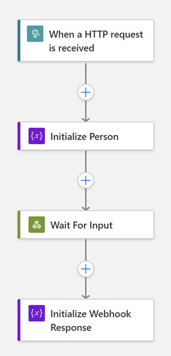

# Azure.LogicApps.NET

Client Library for creating Azure Logic Apps (Standard) Workflow JSON Definition

# Example Use

- Use of a `HTTP Webhook`

```csharp
Workflow workflow = new WorkflowBuilder()
	.WithKind(WorkflowKind.Stateful)
	.WithRequestTrigger(new RequestTrigger()
	{
		EnableSchemaValidation = true,
		Inputs = new RequestTrigger.RequestTriggerInputs
		{
			Schema = new
			{
				FirstName = "",
				LastName = "",
			}
		}
	})
	.AddAction(new InitializeVariable()
	{
		ActionIdentifier = "Initialize_Person",
		Inputs = new InitializeVariable.Input
		{
			Variables = new List<InitializeVariable.Variable>
			{
				new InitializeVariable.Variable
				{
					Name = "person",
					Type = VariableDataType.Object,
					Value = "@triggerBody()"
				}
			}
		}
	})
	.AddAction(new HttpWebhook
	{
		ActionIdentifier = "Wait_For_Input",
		Inputs = new HttpWebhook.HttpWebhookInput
		{
			Subscribe = new HttpWebhook.HttpWebhookSubscription
			{
				Method = "POST",
				Uri = "https://requestbin.com/something",
				Body = new
				{
					Person = "@variables('person')",
					CallbackUrl = "@listCallbackUrl()"
				}
			}
		}
	})
	.AddAction(new SetVariable()
	{
		ActionIdentifier = "Initialize_Webhook_Response",
		Inputs = new SetVariable.Variable
		{
			Name = "person",
			Value = "@body('Wait_For_Input')"
		},
	})
	.Build();

string jsonString = workflow.ToWorkflowJsonString();
```
Output
```json
{
  "definition": {
    "$schema": "https://schema.management.azure.com/providers/Microsoft.Logic/schemas/2016-06-01/workflowdefinition.json#",
    "actions": {
      "Initialize_Person": {
        "type": "InitializeVariable",
        "inputs": {
          "variables": [
            {
              "name": "person",
              "type": "object",
              "value": "@triggerBody()"
            }
          ]
        },
        "runAfter": {}
      },
      "Wait_For_Input": {
        "type": "HttpWebhook",
        "inputs": {
          "subscribe": {
            "method": "POST",
            "uri": "https://requestbin.com/something",
            "headers": null,
            "body": {
              "person": "@variables(\u0027person\u0027)",
              "callbackUrl": "@listCallbackUrl()"
            },
            "authentication": null
          },
          "unsubscribe": null
        },
        "runAfter": {
          "Initialize_Person": [
            "Succeeded"
          ]
        }
      },
      "Initialize_Webhook_Response": {
        "type": "SetVariable",
        "inputs": {
          "name": "person",
          "value": "@body(\u0027Wait_For_Input\u0027)"
        },
        "runAfter": {
          "Wait_For_Input": [
            "Succeeded"
          ]
        }
      }
    },
    "triggers": {
      "Manual": {
        "type": "Request",
        "kind": "Http",
        "inputs": {
          "schema": {
            "firstName": "",
            "lastName": ""
          }
        },
        "operationOptions": "EnableSchemaValidation"
      }
    },
    "contentVersion": "1.0.0.0",
    "outputs": null
  },
  "kind": "Stateful"
}
```


# Currently supported

## Triggers

- Request
- Recurrence

## Actions
- Http
- Http Webhook
- Control
    - Condition
    - Switch
    - Until
- Variables
    - Initialize variable
    - Set variable